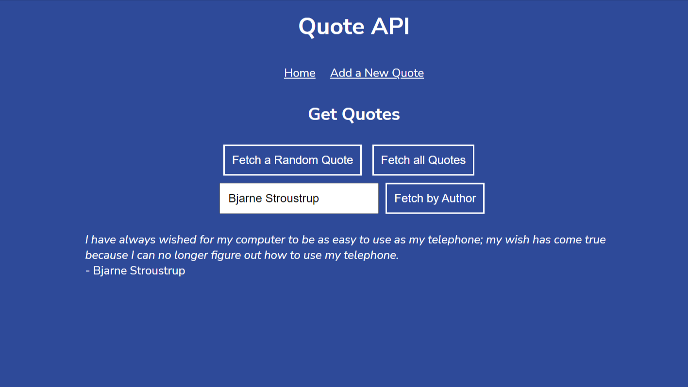

# QUOTE API

A web API, built with Express and Node.js, that stores and serves quotes about computers, coding and technology.

## General info

 This is a challenge project set as part of the Codecademy Full-Stack Engineer career path course. It builds upon the skills acquired during the 'Build a backend with Node.js and Express' module of the course.

## Frontend view of the project



## Technologies

* Node and Node Package Manager
* Git & GitHub
* Express

## Languages

* JavaScript

## Features

The GUI allows users to:
* Generate a random quote
* Search for quotes by author
* Add a new quote
* View the full list of quotes

## Setup
To run the project locally in your machine;
```bash
Run npm install
````
in the project directory
